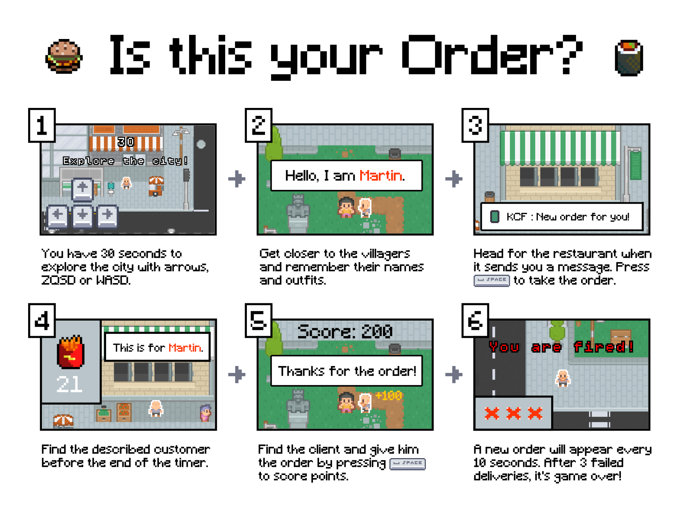

# Is this your Order?
## About
You are a **delivery man** in a small town and suddenly... everyone is hungry!
You have to deliver to the villagers as quickly as possible thanks to clues 
given by the restaurants. Get to know the locals to deliver faster. 

Beware, if you don't deliver your orders in time, you will be fired!

This game was created by Martin Boué and Thomas Le Goff as part of the 51st
edition of the game jam "Ludum Dare" whose theme was "Every 10 seconds".

Made with [Kaboom JS](https://kaboomjs.com/).

## Tutorial


## Usage
### Requirements
Install NodeJS

### Dev
Run :
```
npm install
```

Start game in local :
```
npm run dev
```

Your should see the game in your browser.

### Build
Run :
```
npm run build
```

### Deploy
To deploy on Ludum Dare or itch.io: 

1. zip the content of the `dist` folder.
2. Rename the zip file to `is-this-your-order-vX.X.X` with the current version.
3. Upload the zip file.

## Credits
### Contributors
- Martin Boué
- Thomas Le Goff

### Assets
- [Roguelike Modern City by Kenney](https://kenney.nl/assets/roguelike-modern-city)
- [RPG Urban Pack by Kenney](https://kenney.nl/assets/rpg-urban-pack)
- [Input Prompts Pixel 16x by Kenney](https://kenney.nl/assets/input-prompts-pixel-16)
- [Alifdoll's Pixel Food by Alifdoll](https://alifdoll.itch.io/pixel-food-asset)

### Sounds
- [City on Speed by Section 31 - Tech](https://opengameart.org/content/city-on-speed)

### Energy for the team
- Delicious cookies by my girlfriend <3